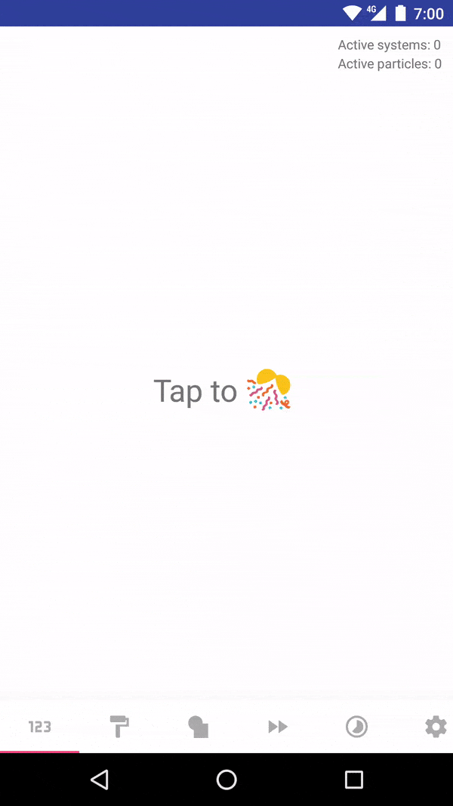

<h1 align="center">Konfetti 🎊</h1></br>

<p align="center">
    <a href="https://opensource.org/licenses/ISC"></a>
    <a href="https://android-arsenal.com/api?level=16s"></a>
    <a href="https://github.com/KotlinBy/awesome-kotlin"></a>
    <a href="http://twitter.com/dionsegijn"></a>
    <a href="https://github.com/DanielMartinus/Konfetti/actions"></a>
</p>

<p align="center">
    🥳 Celebrate more with this lightweight confetti particle system. Create realistic confetti by implementing this easy to use library.
<p>


## Demo app

[]()

#### Sample app

Download on Google Play:

<a href="https://play.google.com/store/apps/details?id=nl.dionsegijn.confettiattempt">
  
</a>

Or download the APK [here](https://github.com/DanielMartinus/Konfetti/releases/download/1.0/sample_app.apk)

## Usage


### XML

All you need in your layout is the KonfettiView to render the particles on:

```XML
<nl.dionsegijn.konfetti.KonfettiView
        android:id="@+id/viewKonfetti"
        android:layout_width="match_parent"
        android:layout_height="match_parent" />
```

### Example in Kotlin

```Kotlin
viewKonfetti.build()
    .addColors(Color.YELLOW, Color.GREEN, Color.MAGENTA)
    .setDirection(0.0, 359.0)
    .setSpeed(1f, 5f)
    .setFadeOutEnabled(true)
    .setTimeToLive(2000L)
    .addShapes(Shape.Square, Shape.Circle)
    .addSizes(Size(12))
    .setPosition(-50f, viewKonfetti.width + 50f, -50f, -50f)
    .streamFor(300, 5000L)
```

### Example in Java

```Kotlin
final KonfettiView konfettiView = findViewById(R.id.konfettiView);
konfettiView.setOnClickListener(new View.OnClickListener() {
    @Override
    public void onClick(final View view) {
        konfettiView.build()
                .addColors(Color.YELLOW, Color.GREEN, Color.MAGENTA)
                .setDirection(0.0, 359.0)
                .setSpeed(1f, 5f)
                .setFadeOutEnabled(true)
                .setTimeToLive(2000L)
                .addShapes(Shape.Square.INSTANCE, Shape.Circle.INSTANCE)
                .addSizes(new Size(12, 5f))
                .setPosition(-50f, konfettiView.getWidth() + 50f, -50f, -50f)
                .streamFor(300, 5000L);
    }
});
```
See sample code here: https://github.com/DanielMartinus/Konfetti/blob/main/demo-simple-java/src/main/java/nl/dionsegijn/simple_demo/MainActivity.java

### Custom shapes

Add a custom shape by using:

```Kotlin
Shape.DrawableShape(drawable: Drawable)
```

The 3D flip effect works best for symmetrical shapes, for example a drawable with a width and a height of 24x24.

### Indefinite streams

Stream for an indefinite amount of time using `StreamEmitter.INDEFINITE`

```Kotlin
viewKonfetti.build()
    ...
    .streamFor(particlesPerSecond = 300, emittingTime = StreamEmitter.INDEFINITE)
```

The only way to stop streams that run for an indefinite amount of time is either by calling:

#### Reset

Call reset to immediately stop rendering all particles.

```Kotlin
viewKonfetti.reset()
```

#### stopGracefully

Call this function to stop rendering new particles. The ones visible will live out their lifetime.

```Kotlin
viewKonfetti.stopGracefully()
```

## Download

Add the following dependency in your app's build.gradle

```groovy
dependencies {
      implementation 'nl.dionsegijn:konfetti:1.2.6'
}
```
 [  ](https://bintray.com/danielmartinus/maven/Konfetti/_latestVersion)

### Java project

If you haven't configured Kotlin for your Java only project, add the following to your project:

`implementation 'org.jetbrains.kotlin:kotlin-stdlib-jdk7:$latest_version'`

Read more about the latest version and kotlin via gradle here: https://kotlinlang.org/docs/reference/using-gradle.html

## Community

Need help or want to receive the latest updates? Join the telegram groups:

[](https://t.me/konfetti_chat) [](https://t.me/konfetti_announcements)

## Contribute

There is always room for improvement.

#### Report issue

Did you encounter bugs? Report them [here](https://github.com/DanielMartinus/Konfetti/issues). The more relevant information you provide the easier and faster it can be resolved.

#### Contribute

As mentioned, there is always room for improvement. Do you have any performance improvement ideas? Please suggest them [here](https://github.com/DanielMartinus/Konfetti/issues). Before submitting a large Pull Request, creating an issue to discuss your ideas would be the preferred way so we can be sure it is in line with other improvements currently being developed. Is it a simple improvement? Go ahead and submit a Pull Request! I very welcome any contributions.

## Roadmap

In line with the previous contribute section there are some already known issues that could be resolved and are open for discussion.

- ~~Determining the size of the particles in the current implementation is not ideal. More here: [#7 Confetti size system](https://github.com/DanielMartinus/Konfetti/issues/7)~~
- A performance improvement to the library could for one be to implement a shared object pool amongst all particle systems instead of having them to handle confetti instances themselves.

## License

Konfetti is released under the ISC license. See [LICENSE](https://github.com/DanielMartinus/Konfetti/blob/main/LICENSE) for details.
